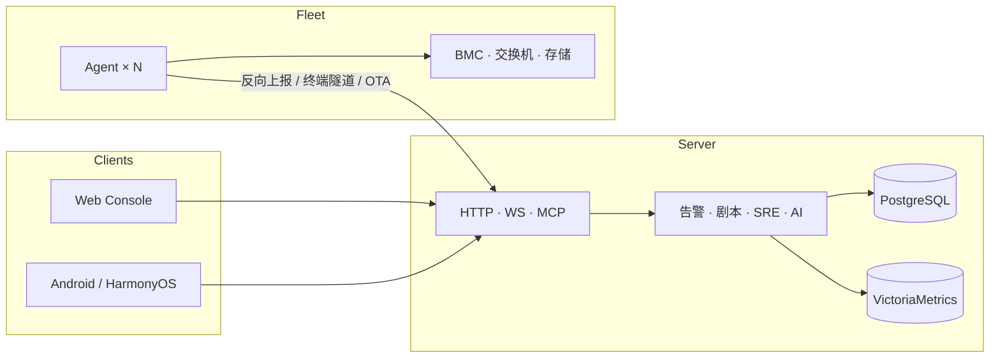

<div align="center">

# AIOps

**一个开源、可私有化的主机监控与 SRE 运维平台**  
观测 · 告警 · 自愈 · 远程运维 · Agent OTA · AI 诊断 —— 收敛进一个你完全掌控的二进制。

[](https://github.com/sreyun/openaiops/releases/tag/v0.20.49)
[](https://go.dev)
[](LICENSE)
[]()
[](https://github.com/sreyun/openaiops)

**[简体中文](README.md) · [繁體中文](docs/i18n/zh-TW.md) · [English](docs/i18n/en.md) · [日本語](docs/i18n/ja.md) · [한국어](docs/i18n/ko.md) · [Français](docs/i18n/fr.md) · [Deutsch](docs/i18n/de.md) · [Español](docs/i18n/es.md) · [Português](docs/i18n/pt-BR.md) · [Русский](docs/i18n/ru.md)**

[快速开始](#-3-分钟上手) · [默认凭据](#-默认登录凭据) · [核心能力](#-核心能力) · [文档中心](docs/README.md) · [变更日志](CHANGELOG.md) · [Releases](https://github.com/sreyun/openaiops/releases)

</div>

---

## 为什么选 AIOps

运维工具越堆越多：监控一套、告警一套、终端一套、剧本又一套；商业产品还按主机/模块计费，数据却在别人的云上。

AIOps 把高频路径收敛为 **一个可自托管的平台**：

| | AIOps | 典型拼装栈 |
|---|---|---|
| **组件** | 1 个 Go 服务端 + 1 个零依赖 Agent | Zabbix / Prometheus / Grafana / Alertmanager / 堡垒机 / 剧本系统… |
| **上线** | `docker compose up -d`，约 3 分钟 | 多组件联调，常以天计 |
| **数据** | PostgreSQL + VictoriaMetrics，**永久自持** | SaaS 或分散多库 |
| **远程** | Web 终端 / 桌面 / 端口转发，Agent **反向连接**免开入站 | 另购堡垒机或 VPN |
| **机群** | **Agent OTA 自动升级**（SHA-256 校验、维护窗、批量推送、失败回滚） | 逐台 SSH 替换二进制 |
| **闭环** | 告警 → 剧本/自愈 → 事件/SLO/工单 → AI 研判 | 工具之间靠人肉粘合 |
| **许可** | **AGPL-3.0**，无主机数阉割 | 按节点 / 模块收费 |

> 适合：自建机房、混合云、信创环境；需要「看得见、管得住、改得动、说得清」的运维与 SRE 团队。

---

## 🔑 默认登录凭据

| 项目 | 值 |
|---|---|
| **Web 控制台地址** | `http://<服务器IP>:8529` |
| **默认用户名** | `admin` |
| **默认密码** | `admin` |
| **首次登录** | 强制修改密码（`MustChangePassword`），改密后方可正常使用 |

> **安全提醒**：生产环境部署后请**立即修改默认密码**并启用 MFA（多因素认证）。如忘记密码，可通过服务端命令行工具重置：`./aiops-server -reset-admin`。

---

## ✨ 核心能力

围绕七条主线，而不是功能清单堆砌：

```
  观测 ──────────► 治理 ──────────► 自愈 ──────────► 诊断
  主机/GPU/日志      静默·抑制·路由     剧本·审批护栏     AI·RAG·MCP
  拨测/API/带外      多渠道通知         事件·SLO·工单     证据门控

  远程运维 · 终端/桌面/转发（反向隧道）     机群 · Agent OTA 自动升级
  安全 · RBAC/MFA/FIM/审计
```

### 1. 观测 —— 看得见

- **跨平台原生采集**：Linux / Windows / macOS / 麒麟等，Agent **零第三方依赖**。
- **指标与日志**：CPU·内存·磁盘·网络·进程·GPU；日志增量上报，可全文检索。
- **业务与带外**：HTTP/TCP/Ping 拨测、API 可用率；Redfish / SNMP / NetFlow / 容器 / K8s / Hyper-V。

### 2. 治理 —— 管得住噪音

- 阈值档位 + **静默 / 抑制 / 路由**，危急走电话短信、警告走 IM。
- 飞书 / 钉钉 / 邮件 / 短信 / 语音；告警生命周期与恢复通知。

### 3. 自愈与 SRE —— 改得动、可度量

- **剧本**：多步骤并行、目标按主机树多选、审批与危险命令护栏。
- **事件 / SLO / 工单 / 消息中心**一条链路；变更冻结窗与 break-glass 可审计。

### 4. AI 诊断 —— 说得清

- 巡检与根因研判（OpenAI 兼容模型，未配置时启发式兜底）。
- **RAG**（pgvector）+ Skills；**MCP** Streamable HTTP，对接 Cursor / Claude。
- 对话 / 语音（TTS·STT）可在设置页一键自测。

### 5. 远程运维 —— 进得去

- **Web 终端**：反向通道、录制回放、旁观、命令审计、二次密码；Linux/macOS 完整交互权限。
- **远程桌面**：JPEG / H.264、多屏、文件与剪贴板。
- **端口转发 / HTTP 代理**：跳板进内网服务，SSRF 防护。

### 6. 安全与交付 —— 扛得住

- RBAC（admin / operator / viewer）· MFA · Agent 机器指纹 · 配置 AES-256-GCM。
- 主机/Web 安全扫描、FIM、内容审计（合规可控）。
- Web 控制台与 **Android / HarmonyOS** 客户端独立分发。

### 7. Agent OTA —— 机群升得动

服务端升级后，**无需逐台登录**即可把采集端推到同一版本：

- **自动 OTA**（默认开启）：在线且版本落后的 Agent 会在上报时自动入队；也可在控制台 **批量 / 选择性推送**，或调用 `POST /api/v1/agents/update`。
- **安全换版**：从服务端 `/dl/` 拉取匹配 **OS/架构** 的二进制（含 Windows Server 2012 专用构建），**SHA-256 校验**；换版前备份 `.bak`，失败自动回滚。
- **可控灰度**：维护窗口（`HH:MM-HH:MM`）、按主机 / 分类豁免、连续同因失败熔断；`GET /api/v1/agents/auto-update-status` 可查看每台「为什么没升级」。
- **全链路可观测**：任务状态 `running → pending_verify → success/failed`；Windows / Linux / macOS 均有独立升级助手与日志，控制台可拉取现场证据。
- **部署注意**：OTA 走 Agent **反向长连接**（与远程终端相同）；Nginx 反代须关闭双向缓冲并放行 WebSocket，否则会出现「指标正常、升级永远失败」——见 [deploy/nginx-aiops.conf](deploy/nginx-aiops.conf) 与 [docs/getting-started/deploy.md](docs/getting-started/deploy.md)。

当前版本 **[v0.20.49](https://github.com/sreyun/openaiops/releases/tag/v0.20.49)** · 镜像 [GitHub](https://github.com/sreyun/openaiops) / [Gitee](https://gitee.com/bigdatasafe/openaiops)

---

## 🚀 3 分钟上手

> 服务端**强依赖** PostgreSQL 与 VictoriaMetrics，缺一不可。

```bash
# 1) 生成强随机密钥到 .env（PostgreSQL 密码、AIOPS_SECRET_KEY 等）
bash scripts/secure-compose.sh
#    Windows：powershell -ExecutionPolicy Bypass -File scripts/secure-compose.ps1

# 2) 一键拉起 server + VictoriaMetrics + Postgres(pgvector)
docker compose up -d

# 3) 浏览器打开 http://localhost:8529
#    默认账号：admin / admin（首次登录强制修改密码）
#    完成首次安全初始化 →「安装命令」页生成 Agent 指令 → 粘贴到目标主机
#    服务端升级后，Agent 默认会自动 OTA 到同版本（可在控制台调整策略）
```

二进制 / 源码构建：

```bash
export AIOPS_POSTGRES_DSN="postgres://aiops:密码@127.0.0.1:5432/aiops?sslmode=disable"
export AIOPS_VM_URL="http://127.0.0.1:8428"
./aiops-server   # 默认 :8529

go build ./cmd/server ./cmd/agent   # 需 Go 1.26+
```

完整步骤 → **[docs/getting-started/install.md](docs/getting-started/install.md)** · 生产加固 → **[docs/getting-started/deploy.md](docs/getting-started/deploy.md)**

---

## 🏗 架构一览



- **Agent 主动出站**：机房无需为每台机器开 SSH/RDP 入站；指标上报、远程终端与 **OTA 升级** 共用反向长连接。
- **关系与时序分离**：审计 / 工单 / RAG 在 PG；指标趋势在 VictoriaMetrics。
- **机群换版**：服务端内置各平台 Agent 二进制（`/dl/`）；版本落后时自动或手动推送，Agent 本地校验 SHA-256 后热替换并重启服务。

---

## 📚 文档中心

所有长文与多语言简介在 [`docs/`](docs/README.md)；根目录仅保留本 README 与变更日志。

| 你想… | 打开 |
|------|------|
| 安装 Agent / 服务端 | [docs/getting-started/install.md](docs/getting-started/install.md) · [EN](docs/getting-started/install.en.md) |
| 生产部署 / 备份 / 容灾 | [docs/getting-started/deploy.md](docs/getting-started/deploy.md) · [EN](docs/getting-started/deploy.en.md) |
| Agent OTA 升级 / 浸泡验收 | [docs/engineering/agent-update-soak.md](docs/engineering/agent-update-soak.md) |
| 按功能学怎么用 | [docs/guides/user-guide.md](docs/guides/user-guide.md) |
| 端口转发 | [docs/guides/forward.md](docs/guides/forward.md) |
| 内容审计与剧本 | [docs/guides/content-audit.md](docs/guides/content-audit.md) |
| CI / SQL 门禁 | [docs/engineering/ci-gate.md](docs/engineering/ci-gate.md) |

---

## 🤝 贡献与社区

欢迎 Issue / PR / 翻译。开发前建议：`make build` · `make audit`（vet / test / govulncheck 等）。

- 面板 i18n：`cmd/server/web/i18n-dashboard*.js`
- 安全漏洞请私信，勿公开 Issue

如果 AIOps 帮你省下了一套拼装栈，**请点一下 Star** —— 这是对开源维护最直接的支持。

---

## 📄 许可证

[AGPL-3.0](LICENSE) · 无主机数限制、无功能阉割套路。`vendor/` 遵循各自许可证；移动端为独立分发包，源码不在本仓库。

---

<p align="center">
  <b>AIOps · 把运维的复杂度，收敛进一个你完全掌控的平台。</b><br/>
  <sub>Star ⭐ · Fork · 提 Issue · 一起把自托管运维做扎实</sub>
</p>
